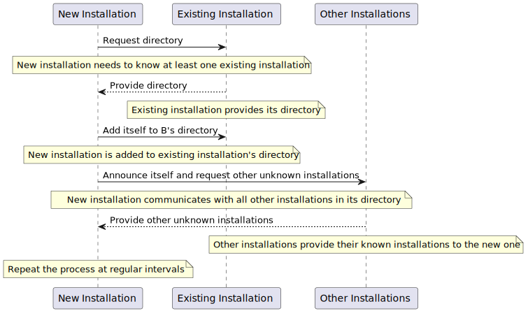

# Architecture

The system is divided into different layers. Layer 5 is the interaction layer, Layer 4 is the logic layer, and Layer 1 is the data layer.

Layer 5 (Interaction) contains the user interface and the admin interface. These interfaces are housed within React Container 1 and React Container 2 respectively. The user and admin interact with these interfaces via browsers. The user's browser interaction is anonymous while the admin's browser interaction includes JWT claims.

Layer 4 (Logic) is the core of the system and consists of multiple components. The NGINX container holds the Nginx boundary which runs the Web Gateway housed in the Gateway Container. The Gateway Container also contains the Open Catalogi plugin and the ORM (Object-Relational Mapping). The Gateway implements these plugins and interacts with the identity component in the Azure cloud. The Gateway also indexes to MongoDB, caches to Redis, and stores data to the ORM.

The Redis Container houses the Redis component, and the MongoDB Container houses the MongoDB database. The Gateway logs to Loki and reports to Prometheus. The Open Catalogi plugin exchanges information with the external catalog based on PKI (Public Key Infrastructure).

Layer 1 (Data) contains a Database Service which includes various database systems like Postgress, MsSQL, MySql, and Oracle. The ORM persists data to these databases.

The system is housed within a Kubernetes cluster. The ingress component exposes the user interface, the admin interface, and the Nginx component. The ingress interacts with the F5 extern for only public endpoints and objects and with the F5 intern for all endpoints. It also interacts with the Hipp component for catalog exchanges.

The external catalog interacts with the Hipp component using PKIO. The Hipp component is out of scope for the system.

The Azure cloud contains the ADFS component which serves as an identity provider.

Finally, the system includes an External Catalogue actor which interacts with the Hipp component, and an Admin actor who interacts with the F5 intern component via a browser with JWT claims. There is also a User actor who interacts with the F5 extern component via an anonymous browser.

## How does open catalogi form an federated network
Each Open Catalogi installation (referred to as a Catalog) maintains a directory listing of other known installations (or catalogs). When a new installation is added to the network, it needs to be aware of, or locate, at least one existing installation. This existing installation provides its directory to the new installation, thereby informing it about all other known installations. During this process, the new installation is also added to the existing installation's directory, which it used as a reference.

Next, the new installation communicates with all other installations listed in its directory. The purpose of this communication is two-fold: to announce its addition to the network, and to inquire if they are aware of other installations that are not yet included in the new installation's directory.

This inquiry process is repeated at regular intervals. Given that each installation maintains its own directory, the network remains robust and operational even if an individual installation becomes unavailable.

## How does open catalogi use a federated network
Live Data:
Every time a query is made to the '/search' endpoint of an Open Catalogi installation, it seeks answers in its own MongoDB index based on certain filters. Simultaneously, it also checks its directory of known catalogs to find other catalogs that might contain the requested data and which the original catalog has access to. The query is also sent asynchronously to these catalogs, and the responses are combined unless a predefined timeout threshold is reached.

Indexed Data:
Open Catalogi prefers to index data when the source allows it. During each network synchronization run (as explained in 'Setting Up a Network'), any data that can be indexed is indexed if the source is set to indexing. It's important to note that when an object is shared from another catalog, a cloud event subscription is established. This means that when the object is updated in that catalog, the changes are also updated almost instantly in the local installation.

> :note:
>
> *   Bronnen worden pas gebruikt door een catalogus als de beheerder hiervoor akkoord heeft gegeven
> *   Bronnen kunnen zelf voorwaarde stellen aan het gebruikt (bijvoorbeeld alleen met PKI certificaat, of aan de hand van API sleutel)
